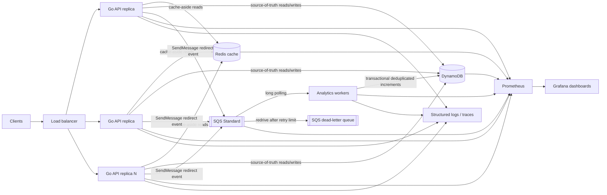
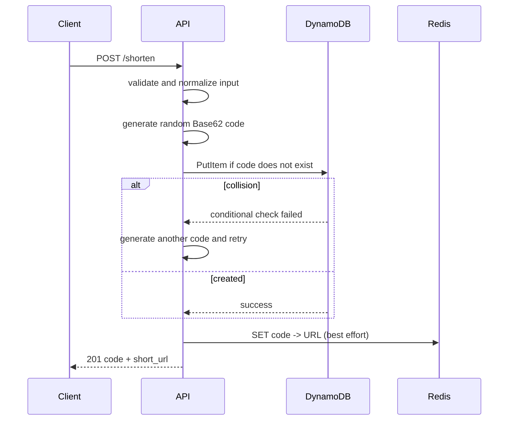
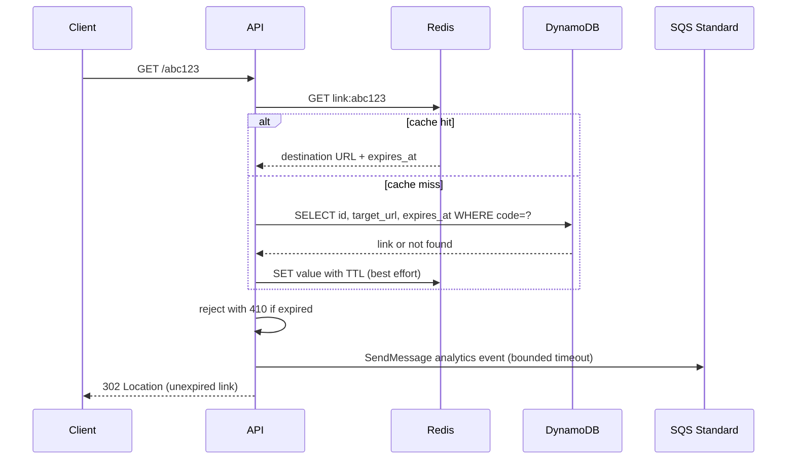

# Distributed URL Shortener — Design Proposal

Status: **Proposed — awaiting approval**

Scope: architecture and implementation plan; no application code or measured load results yet

## 1. Goals and non-goals

### Goals

- Create a globally unique short code for a valid HTTP(S) URL.
- Redirect with low latency under a read-heavy workload (target mix: 95% redirects, 5% creates).
- Record redirect analytics without putting database writes on the redirect critical path.
- Scale API and analytics processing independently.
- Expose enough telemetry to find saturation and demonstrate the effect of scaling changes.
- Run the complete system locally in containers and retain a credible path to production.

### Initial service-level objectives

These are evaluation targets, not measured claims:

| Signal | Target |
|---|---|
| Redirect availability | 99.9% successful service responses, excluding invalid/unknown codes |
| Redirect latency | p95 < 50 ms and p99 < 100 ms at the demonstrated sustainable load |
| Create latency | p95 < 250 ms |
| Analytics freshness | 99% of accepted events reflected in stats within 60 seconds |
| Analytics durability | No SQS-accepted event lost during a single worker restart |

### Non-goals for the first implementation

- Multi-region active-active operation, globally nearest redirects, and disaster recovery automation.
- Authentication, quotas per customer, billing, deletion, custom aliases, and malware scanning.
- End-to-end exactly-once analytics across the HTTP response, SQS, and DynamoDB. The design provides exactly-once aggregate effects for every event accepted by SQS.
- Unique-visitor analytics or storage of IP addresses.

## 2. Proposed architecture



Local deployment uses Docker Compose with one load balancer, multiple API containers, DynamoDB Local, one Redis cache server, LocalStack SQS, one or more worker containers, Prometheus, and Grafana. The application uses configurable AWS endpoints so the same SQS and DynamoDB clients target local emulators without changing business logic.

Production uses managed DynamoDB, Amazon SQS Standard, and a managed Redis cache. Local emulators validate behavior but not AWS capacity, partitioning, availability, durability, or latency; production-scale results must come from an isolated AWS test environment.

### Components

| Component | Responsibility | Scaling unit |
|---|---|---|
| Load balancer | Health checks and request distribution | Usually managed / redundant |
| Go API | Validate/create URLs, cache-assisted redirects, stats reads, enqueue analytics | Horizontal replicas |
| DynamoDB | Durable source of truth for links, sharded aggregate statistics, and processed-event IDs | Managed horizontal partitioning; on-demand initially |
| Redis cache | Hot-code cache; disposable data | Memory/CPU sizing; clustered only when demonstrated necessary |
| SQS Standard | Managed durable analytics delivery, retry visibility, and dead-letter routing | Managed service; consumers scale from backlog |
| Analytics worker | Consume redirect events and apply idempotent, sharded counter updates | Horizontal consumers |
| Prometheus/Grafana | Metrics collection, dashboards, and alerts | Operational infrastructure |

The API and worker are separate processes (and deployable services) so redirect serving is not coupled to analytics write throughput.

## 3. API contract

### `POST /shorten`

Request:

```json
{"url":"https://example.com/some/very/long/path"}
```

Response (`201 Created`):

```json
{"short_url":"http://localhost:8080/abc123","code":"abc123","expires_at":"2026-10-23T12:00:00Z"}
```

- Accept only absolute `http` and `https` URLs with a host.
- Enforce a configured maximum length (proposed: 2,048 bytes).
- Set expiry from a deployment setting, `LINK_TTL`, with a default of 30 days. The first API version does not allow callers to override it per request.
- Different create calls for the same URL may produce different codes. Idempotency keys can be future work.
- Return `400` for invalid input, `429` when admission limits are exceeded, and `503` for unavailable dependencies.

### `GET /{code}`

- Return `302 Found` with `Location` set to the original URL. A temporary redirect avoids clients permanently caching a target that may later become administratively disabled.
- Return `404` for an unknown code and `410 Gone` for a known but expired link.
- Successful lookup and redirect do not wait for analytics aggregation.

### `GET /stats/{code}`

```json
{"url":"https://example.com/some/very/long/path","clicks":12345}
```

- Aggregate counts are eventually consistent.
- Return `404` for an unknown code.
- The first version reports total clicks; time-bucketed statistics are a future extension.

### Operational endpoints

- `GET /health/live`: process is alive; no dependency calls.
- `GET /health/ready`: required dependencies can serve traffic.
- `GET /metrics`: Prometheus exposition endpoint, kept off the public ingress in production.

## 4. Identifiers and short-code generation

Generate a cryptographically random 10-character Base62 code. This provides about 839 quadrillion possible values, distributes writes across DynamoDB partitions, and does not expose creation order or approximate business volume.

Creation sequence:



The conditional write is the uniqueness authority. Collisions are expected to be extremely rare but are handled with a small bounded retry count; exhaustion returns `503`. Codes are difficult to enumerate but are not authorization secrets.

## 5. Data model and database choice

DynamoDB is selected because the dominant operations are point reads and conditional inserts keyed by a uniformly distributed short code. It removes a relational primary and connection pool as horizontal scaling boundaries, provides managed partitioning and availability, and supports conditional and transactional writes needed for uniqueness and analytics deduplication. On-demand capacity is the initial production mode because demo and early traffic are unpredictable; provisioned capacity can be evaluated after a stable traffic profile exists.

Proposed logical tables:

| Table | Partition key | Important attributes | Purpose |
|---|---|---|---|
| `Links` | `code` | `creation_token`, `target_url`, `created_at`, `expires_at`, `ttl` | Authoritative link lookup |
| `LinkStats` | `code_shard` | `code`, `shard`, `clicks`, `last_clicked_at` | Write-sharded click aggregates |
| `ProcessedEvents` | `event_id` | `processed_at`, `ttl` | Durable analytics deduplication |

Notes:

- New links default to `expires_at = creation time + LINK_TTL` (30 days unless configured otherwise). Store the absolute timestamp so later configuration changes do not retroactively alter existing links.
- Each create attempt generates a `creation_token`. After an ambiguous conditional-write response, a strongly consistent read treats the operation as successful only when the stored token matches; otherwise the code collided and the API generates another one.
- `ttl` is the same instant as `expires_at`, represented as Unix epoch seconds for DynamoDB TTL cleanup. Because TTL deletion is asynchronous, every application read still enforces `expires_at`; while an expired item remains, redirect returns `410`, and after physical deletion it returns `404`.
- Raw click events remain in SQS only for the configured message-retention period. DynamoDB stores aggregates rather than an indefinitely growing click-event history.
- Retain `ProcessedEvents` records longer than the maximum SQS retention and redrive window. Their DynamoDB TTL then removes them asynchronously without a cleanup worker.
- `LinkStats` uses a fixed initial shard count (proposed: 16). A deterministic hash of `event_id` selects the shard, preventing one popular link from concentrating all analytics writes on one item. Stats reads fetch and sum all shards.
- SDK calls use bounded concurrency, deadlines, jittered backoff for retryable throttling, and propagated Go context cancellation. Unlike PostgreSQL, API replicas do not consume database connections.
- Enable point-in-time recovery for production tables. DynamoDB Local does not represent production durability or availability.
- No secondary indexes are required for the initial access patterns; operational scans must not be placed on request paths.

### Consistency

| Operation | Model |
|---|---|
| Create | Strong: response only after a successful conditional DynamoDB write |
| Redirect mapping | Strongly consistent `GetItem` on cache miss; cached mappings never live past expiry |
| Unknown code | Negative-cache TTL bounds stale 404s |
| Click count | Eventual: bounded by queue and worker lag |
| Analytics event delivery | At least once; per-event transaction gives exactly-once aggregate effects |

Destinations and expiry timestamps are immutable in the first version, eliminating update-related cache invalidation races. Every redirect still checks the stored expiry, and cache entries are bounded by it. If editing destinations or extending expiry is added, use write-through invalidation plus a version or short TTL.

## 6. Redirect and caching path



Cache policy:

- Cache-aside keys: `link:{code}` containing destination URL and absolute expiry.
- Positive TTL: `min(24 hours plus downward jitter, time until link expiry)`, so Redis cannot serve a link beyond its expiry.
- Negative TTL: proposed 30 seconds to protect DynamoDB from repeated random-code scans.
- In-process request coalescing for the same missing hot key is optional after measurement; avoid a new dependency merely to implement it.
- Redis is an optimization for URL lookup, so cache failure falls back to DynamoDB.
- Populate cache after a successful create as a best-effort optimization.

### Cache correctness and resilience

- DynamoDB remains authoritative.
- Because destinations and expiry timestamps are immutable and cache TTL never crosses expiry, stale positive entries are safe in the initial design.
- Redis calls use short deadlines. A circuit breaker/cooldown stops every request waiting on a failing cache; requests then go directly to DynamoDB.
- Cache recovery can create a DynamoDB read and cost surge. Bounded request concurrency, load shedding, on-demand maximum-throughput safeguards, and controlled warm-up protect the backing store and cost envelope.
- Cache hit ratio and fallback traffic are capacity signals, not merely dashboard decoration.

## 7. Asynchronous analytics

Each successful, unexpired redirect attempts to send a small event with an API-generated UUID to an SQS Standard queue:

```text
event_id, code, redirected_at, status, user_agent_family(optional)
```

Workers use SQS long polling and bounded receive batches, but commit each event with one DynamoDB `TransactWriteItems` operation:

1. Conditionally put `ProcessedEvents[event_id]` only if it does not exist.
2. Atomically add one to `LinkStats[code#shard(event_id)]` and update `last_clicked_at`.

After the transaction succeeds, the worker deletes the SQS message. If the transaction is canceled by the deduplication condition, the worker verifies that `ProcessedEvents[event_id]` exists before treating it as a duplicate and deleting the message; throttling, conflicts, and other failures are not deleted and become visible again after the visibility timeout. Per-event transactions cost more than non-transactional batches, but they provide a simple, auditable idempotency guarantee; batch optimization is deferred until measurements justify additional complexity.

If “DynamoDB transaction succeeded, SQS delete failed,” the visibility timeout eventually causes redelivery, but the event ID already exists and its count is not applied again. A producer retry after an ambiguous `SendMessage` reuses the same API-generated event ID. SQS Standard may duplicate or reorder messages, which is safe because aggregation is commutative and deduplicated. This gives **at-least-once transport with exactly-once aggregate effects for SQS-accepted events**.

It does not claim end-to-end exactly-once analytics: returning a redirect to the client and sending to SQS cannot be one atomic transaction. With the chosen availability policy, an SQS outage or bounded send timeout may allow the redirect while losing its event. Requiring confirmed enqueue before redirecting would improve completeness but make redirect availability depend on analytics infrastructure.

### Failure and overload policy

- `SendMessage` has a strict timeout and never waits indefinitely. The API does not spawn unbounded fire-and-forget goroutines.
- Configure SQS retention longer than the maximum expected worker outage, a visibility timeout longer than normal event processing, and long polling to avoid busy polling.
- When queue depth/oldest-event age rises, add workers until DynamoDB write capacity, a hot stats shard, or worker CPU becomes the constraint.
- Worker concurrency and read batch size are bounded. Failed events use exponential backoff with jitter; throttling reduces worker concurrency rather than amplifying retries.
- An SQS redrive policy moves poison events to a dead-letter queue after a configured receive count and triggers an alert.
- If SQS is unavailable, the default policy is **redirect availability over analytics completeness**: serve the redirect and increment `analytics_events_dropped_total`. This means click counts are best-effort during a queue outage and must be stated to users.
- Ordering is deliberately not requested. If future analytics requires ordered partitions, multiple independent consumers, or long replay, evaluate Kinesis rather than SQS FIFO by default.

## 8. Backpressure and failure behavior

| Failure / pressure | Expected behavior | Protection / signal |
|---|---|---|
| Redis cache unavailable | Redirects fall back to DynamoDB; latency and read cost rise | Short timeout, circuit cooldown, concurrency limit, cache error metric |
| SQS unavailable or send times out | Redirect still succeeds; analytics event may be dropped | Strict timeout, drop counter and alert; explicit availability-over-completeness policy |
| Link expires | Redirect returns `410`; no analytics event is emitted | Expiry check on cache hit and database read; cache TTL capped at expiry |
| DynamoDB unavailable/throttled | Cached redirects continue; cache misses, create, and stats fail within a bounded budget | Timeouts, jittered retry, concurrency/admission limits, readiness failure |
| Worker crash | Other workers continue; in-flight messages reappear after visibility timeout | In-flight count, receive count, and oldest-message age |
| Analytics writes throttled | Queue lag grows; redirect path remains mostly isolated | Sharded counters, bounded workers, adaptive concurrency, queue-lag alert |
| API CPU saturated | Queueing raises tail latency, then overload is rejected | Load-balancer scaling and concurrency/admission limit |
| DynamoDB capacity/cost guard reached | Requests are throttled or shed rather than producing unbounded cost | Consumed-capacity/throttle metrics, configured maximum throughput, `503`/`429` |
| Hot or invalid code attack | Cache absorbs hot reads; negative cache limits misses | Rate limit at ingress; per-route metrics |

Retries occur only within a small request budget. A create retry reuses the same generated code and creation token so an ambiguous response can be resolved with a strongly consistent read. Workers can retry because event transactions are idempotent by durable event ID.

Graceful shutdown marks a replica unready, stops accepting new work, and drains in-flight requests for a bounded period. A worker finishes and deletes received messages when possible; otherwise it stops extending visibility and lets SQS make them available to another worker.

## 9. Observability

Use structured JSON logs, Prometheus metrics, Grafana dashboards, and OpenTelemetry-compatible trace instrumentation. To keep the initial Go implementation stdlib-first, direct Prometheus exposition and trace propagation can be implemented locally; adding official client SDKs should be approved if the dependency constraint is strict.

### Metrics

Avoid unbounded labels: route templates and status classes are labels; URL codes and raw URLs are never metric labels.

| Area | Metrics |
|---|---|
| HTTP | requests by route/method/status; duration histogram; in-flight requests; rejected requests |
| DynamoDB | request duration/errors by operation; consumed read/write capacity; throttled requests; transaction conflicts; system errors |
| Redis/cache | operation duration/errors; cache hits/misses; hit ratio; circuit-open count |
| Analytics producer | SQS sends accepted/failed/dropped; send duration |
| Analytics worker | processed/duplicate/failed events; read batches; transaction duration; retries, throttles, and dead-letter counts |
| Queue | visible and in-flight messages; oldest-message age; sent/deleted counts; DLQ depth |
| Runtime | Go heap, allocations, goroutines, GC pauses; process CPU and resident memory |
| Dependencies | DynamoDB capacity/throttles; SQS errors/backlog; Redis CPU, memory, connections, and latency |

Latency percentiles are calculated in Prometheus from histograms, not exported as per-instance percentile gauges.

### Dashboards and alerts

1. **Service overview:** throughput, p50/p95/p99 latency, error ratio, in-flight and rejected requests by route.
2. **Redirect path:** cache hit ratio, Redis latency/errors, DynamoDB fallback rate, request latency, consumed capacity, and throttles.
3. **Analytics:** enqueue/drop rate, oldest-event age, pending depth, worker throughput/failures, transaction duration and throttles.
4. **Resources:** API/worker CPU and memory, Go runtime, DynamoDB capacity/throttles, SQS API errors, and Redis saturation.

Initial alerts: sustained SLO error/latency breach, analytics drops, oldest SQS message beyond 60 seconds, DLQ messages, DynamoDB throttling/system errors, unexpected consumed-capacity or cost growth, low cache hit ratio after warm-up, Redis unavailable, and disk/memory pressure.

Logs include request/trace ID, route, status, duration, and error class. They exclude destination query strings and full user agents by default to reduce sensitive-data exposure. Sample successful redirect logs under high traffic; never sample errors solely because of volume.

## 10. Load-test and scaling plan

Use `k6` (external test tool, not an application dependency) with a seeded pool of codes and a realistic distribution:

- 95% `GET /{code}`, including a Zipf-like hot set and a small unknown-code fraction.
- 5% `POST /shorten` with valid distinct URLs.
- Run from a separate container/host so the generator is not the bottleneck.
- Warm the system consistently or explicitly label cold-cache runs.

### Experiment sequence

1. Baseline: one API, one worker, cold then warm cache.
2. Step load upward at fixed stages; hold each stage long enough for queues, concurrency limits, and dependencies to reach steady state.
3. Define maximum sustainable throughput as the highest stage for which the latency/error SLO holds, resource/queue trends are stable, and analytics lag does not grow continuously.
4. Continue one or two stages past that point to document overload behavior and the first saturated resource.
5. Apply one isolated change, then repeat with identical data, durations, and generator capacity.

Primary demonstration:

- **Before:** one API replica, one analytics worker, optionally record a cache-disabled baseline.
- **After A:** multiple API replicas behind the load balancer; show throughput scaling until Redis, DynamoDB capacity, API CPU, or the load generator becomes limiting.
- **After B:** increase analytics workers and compare queue lag, DynamoDB throttling, and worker throughput; if a hot link limits writes, compare one counter with 16 counter shards.

Do not predict the bottleneck in the final report. Identify it from correlated evidence: CPU, DynamoDB latency/consumed capacity/throttles, Redis latency, cache ratio, queue-age slope, worker throughput, and generator health.

Local DynamoDB results validate functionality only. Any claim about storage scalability or saturation must use a real, isolated AWS DynamoDB table, report its capacity mode and safeguards, and separate service limits/cost guards from application bottlenecks.

### Results template

| Configuration | Offered RPS | Achieved RPS | Redirect p50/p95/p99 | Create p95 | Error % | Cache hit % | Oldest event | Bottleneck |
|---|---:|---:|---|---:|---:|---:|---:|---|
| Baseline | TBD | TBD | TBD | TBD | TBD | TBD | TBD | TBD |
| Baseline saturation | TBD | TBD | TBD | TBD | TBD | TBD | TBD | TBD |
| Scaled | TBD | TBD | TBD | TBD | TBD | TBD | TBD | TBD |

The implementation must not fill this table with estimates. Preserve Prometheus snapshots/screenshots and the exact load-test command/config for reproducibility.

## 11. Security and operational controls

- Validate schemes and length; reject credentials in URLs. In a production public shortener, apply domain policy and malware/phishing scanning.
- The redirect service does not fetch destination URLs, so destination validation is not an SSRF defense boundary; future preview/scanning components must have network egress controls.
- Apply request-body limits, header/read/write/idle timeouts, ingress rate limits, and trusted proxy configuration.
- Do not expose DynamoDB Local, LocalStack, Redis, metrics, or profiling endpoints publicly. Production uses least-privilege IAM for SQS and DynamoDB plus private networking/endpoints where appropriate.
- Store credentials in a secret manager in production, run containers as non-root, use TLS between public clients and ingress, and prefer TLS/authentication for dependencies.
- Avoid storing raw IP addresses. If user-agent metadata is retained, normalize and limit its size.
- DynamoDB TTL performs eventual physical cleanup; expiry enforcement does not depend on deletion timing.
- Table creation and configuration are infrastructure-as-code deployment steps, not startup side effects of every API replica.

## 12. Delivery plan

1. Implement configuration, DynamoDB table definitions, repository, random code generation, and API endpoints with unit/integration tests.
2. Add Redis cache behavior, failure timeouts, and cache metrics.
3. Add SQS analytics producer/worker, sharded counters, per-event transactions, visibility/redrive behavior, and failure tests.
4. Add DynamoDB Local, LocalStack SQS, and one Redis cache server to Compose, plus health checks, Prometheus, Grafana dashboards, and structured logging/tracing.
5. Add infrastructure for an isolated AWS test environment, run the repeatable load test, find saturation, apply scaling changes, and record measured results.
6. Document runbooks, observed failure modes, improvements, and future work in the README.

## 13. Decisions requested from reviewer

Approval of this document means accepting these initial tradeoffs:

1. DynamoDB is the source of truth, using on-demand capacity initially; Redis is only the disposable cache, and SQS Standard is the managed analytics queue.
2. Codes are random 10-character Base62 values created with conditional writes; they resist casual enumeration but are not authorization secrets.
3. Links have immutable destinations and expiry timestamps, default to a configurable 30-day lifetime, use HTTP 302 before expiry, and return `410` afterward; duplicate long URLs may get distinct short codes.
4. Redirect availability takes priority over complete analytics during an SQS outage or send timeout; drops are measured and alerted.
5. Analytics use SQS Standard at-least-once transport, 16 counter shards per link, and per-event DynamoDB transactions, providing exactly-once aggregate effects for SQS-accepted events but not end-to-end exactly-once capture.
6. DynamoDB Local and LocalStack SQS are for development only; credible scale and durability results require AWS. Initial production design is single-region; global tables, authentication, custom aliases, caller-selected expiry, and advanced abuse controls are future work.

If any decision is declined, it should be resolved before implementation because it changes APIs, schema, or failure semantics.

## 14. Known limitations

- DynamoDB Local, LocalStack SQS, and the single-node Redis cache remain failure domains in the local demonstration; local results do not represent managed-service resilience or scale.
- Analytics can be incomplete while SQS is unavailable; redirect delivery cannot atomically guarantee event capture without coupling availability to the queue.
- DynamoDB introduces AWS coupling, request-based cost, and operational dependence on correct partition-key and capacity design.
- Per-event analytics transactions prioritize correctness over write cost and maximum throughput; measurements may justify a more complex batching design.
- Aggregate-only analytics cannot reconstruct arbitrary historical time series.
- Capacity, latency, and saturation are unknown until the implementation is load-tested; all SLOs above are targets.

## 15. DynamoDB implementation references

- [DynamoDB partition-key design](https://docs.aws.amazon.com/amazondynamodb/latest/developerguide/bp-partition-key-design.html)
- [On-demand and provisioned capacity modes](https://docs.aws.amazon.com/amazondynamodb/latest/developerguide/CostOptimization_TableCapacityMode.html)
- [DynamoDB transactions and idempotency](https://docs.aws.amazon.com/amazondynamodb/latest/developerguide/transaction-apis.html)
- [DynamoDB TTL behavior](https://docs.aws.amazon.com/amazondynamodb/latest/developerguide/TTL.html)
- [Write sharding](https://docs.aws.amazon.com/amazondynamodb/latest/developerguide/bp-partition-key-sharding.html)
- [SQS Standard queue delivery semantics](https://docs.aws.amazon.com/AWSSimpleQueueService/latest/SQSDeveloperGuide/standard-queues.html)
- [SQS visibility timeouts and redelivery](https://docs.aws.amazon.com/AWSSimpleQueueService/latest/SQSDeveloperGuide/sqs-visibility-timeout.html)
